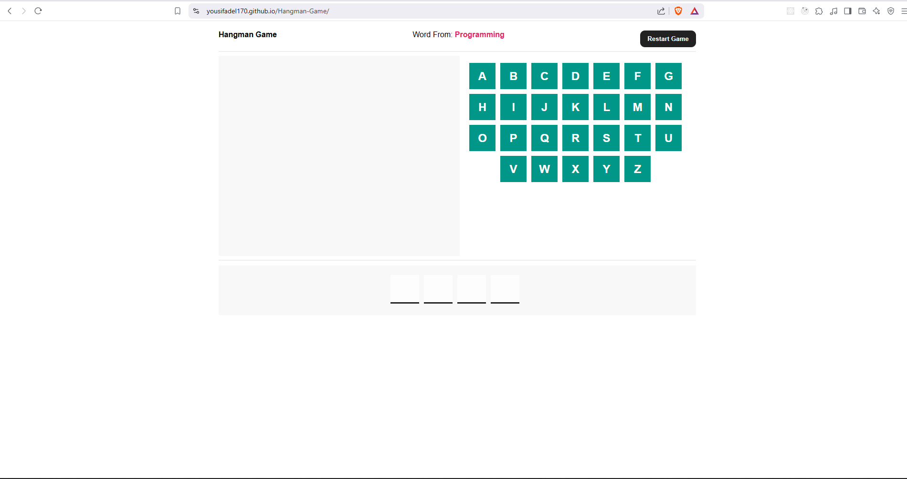
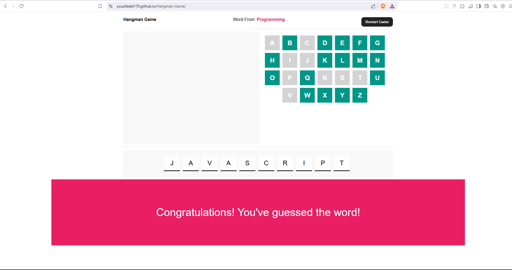
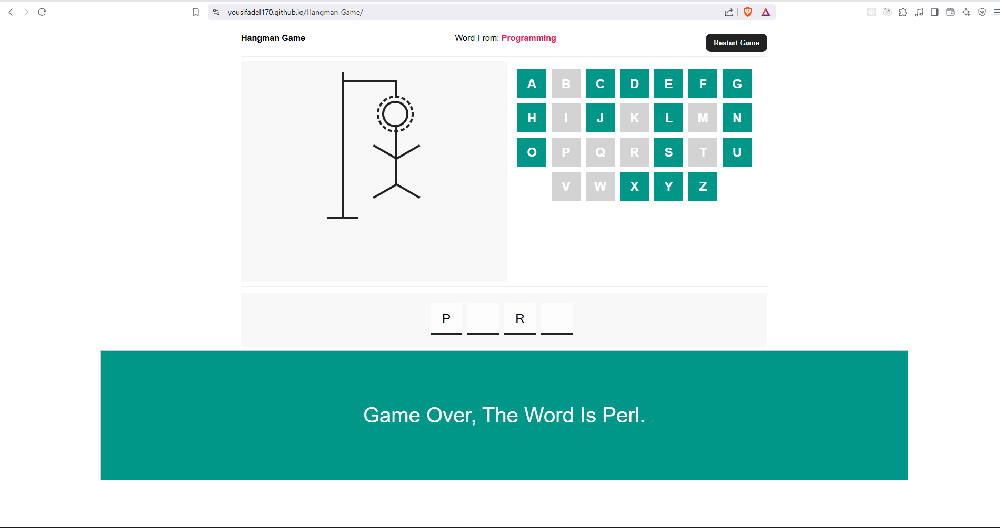
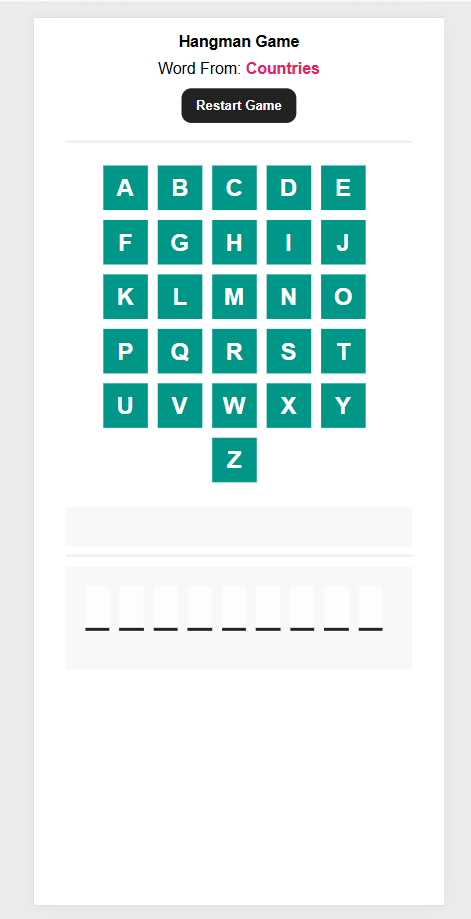

# 🪢 Hangman Game

A fun and interactive Hangman game built with **HTML, CSS, and JavaScript**.  
Guess the hidden word by selecting letters. Each wrong guess draws a part of the hangman. The game ends when the word is guessed correctly or the hangman is fully drawn.

## 🔗 Live Demo

## [Play Hangman Online](https://youssefadel170.github.io/Hangman-Game/)

## 📸 Screenshots

- **Game:**  
  

- **Win:**  
  

- **Lose:**  
  

- **Mobile:**  
  

---

## 🎯 Features

- **Random Word Generation:** Words are selected from categories like Programming, Movies, Countries, and People.
- **Interactive UI:** Click letters to guess, with immediate visual feedback.
- **Sound Effects:** Audio cues for correct and incorrect guesses.
- **Category Hint:** Displays the category of the hidden word.
- **Reset Option:** Restart the game at any time.

---

## 🕹 Game Rules

1. The game starts with a hidden random word.
2. Select letters to guess the word.
3. Correct guesses reveal letters in the word.
4. Incorrect guesses draw parts of the hangman (max 8 wrong attempts).
5. Game ends when either:
   - The player guesses all letters correctly, or
   - All hangman parts are drawn.

---

## 🛠 Technologies Used

- **HTML5** – Structure
- **CSS3** – Styling
- **JavaScript (ES6)** – Game logic and interactivity

---

## 🚀 Getting Started

### Prerequisites

- Any modern web browser.

### Installation

1. Clone the repository:

```bash
git clone git@github.com:YousifAdel170/Hangman-Game.git
```

2. **Navigate into the project directory**
   ```bash
   cd Hangman-Game
   ```
3. Open **index.html** in your browser.

---

## 🎮 Usage

- Click letters to guess the word.
- Correct guesses reveal letters.
- Wrong guesses draw the hangman.
- Click Restart to play a new game.

---

## ⚙️ Customizing

- **Add New Words:** Edit the words object in script.js.
- **Adjust Difficulty:** Change the maxAttempts variable to allow more/less wrong guesses.
